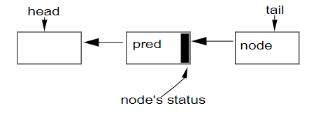

# AbstractQueuedSynchronizer

## 简介

​	JUC从1.5引入，JUC是一些列的中级（低级是接近机器）并发支持类。这些组件是一系列的同步器，AbstractQueuedSynchronizer维护了一个内部同步状态位（state ，state就代表了锁是lock还是unlock状态），其中一些方法用于检查和更写state位，有一些方法会使调用的线程阻塞，有一些方法会改变state以此来唤醒（放行）一些线程。例如：ReentrantLock、CycleBarrier、CountDownLatch、Semaphore、futures……

## 设计

### 为什么要用AQS

​	任何同步器几乎可以被用来实现其他的同步器，但是这样做是相当复杂的，而且没有什么概念性可言。基于此，AQS就出现了

### 那么要实现一个能够作为其他同步器实现的基础框架，有什么要求呢

- 功能上来说：AQS必须要拥有两种这样的方法
  1. 至少一种acquire方法，这个方法可以使调用的线程进入阻塞状态，直到同步状态位（state）被改变
  2. 至少一种release方法，这个方法可以以某种方式改变同步状态位（state），使一个或多个线程被解除阻塞
- 从API设计上来说：AQS并没有定义一个统一的同步器API。有些是通过通用接口定义的，但其他的同步器只包含专门的版本，所以acquire和release操作有一系列的名称和形式不同的类，例如，方法Lock.lock,Semaphore.acquisition, CountDownLatch.await, 和
  FutureTask.get都映射为框架中的获取操作。但是该包定义了一系列的常见的选项：
  1. tryAcquire：非阻塞性尝试lock
  2. 超时acquire
  3. 允许线程中断的acquire
- 还必须实现独占模式和共享模式：例如Semaphore，就允许同一时间有多个线程获取permit

### 性能指标

​	由于Java中的每个类都可以被当作锁对象使用，在sync代码块的设计中，重点是减少时间和空间的开销。然而实际情况是，同步器只有在使用的时候才创建，这样就避免了压缩空间所带来的额外开销，而且在多线程情况下，竞争也是可以预期的。—— sync的策略不合适

​	这里的主要性能目标是**<u>可扩展性</u>**：即使是在同步器被争夺时，也能可预测的保持效率。理想的情况是，无论同步点如何变化，通过同步点（竞争所带来的开销）所带来的开销应该是恒定的，即无论多少个线程想要通过同步点，开销都是恒定的。这样一来，**主要的目标就是**——最大限度的减少某些线程被允许通过同步点，但尚未通过同步点的时间总量（多线程竞争时发生的额外开销）。这就必须考虑资源的消耗——CPU时间要求、内存流量、线程调度开销。（例如自旋锁就提供比阻塞更短的时间获取锁，但是比较耗费CPU时间）

​	基于上述观点，要平衡开销，应该是要有取舍——非公平锁和公平锁。非公平锁吞吐量更高，但可能会产生线程饥饿；公平锁吞吐量稍低，但不会产生线程饥饿。

​	但是，无论内部构造的多好，在某些应用都会无可避免的产生性能瓶颈。因此，框架必须提供能够监测和检查的基本操作，使开发者能确定哪些线程被阻塞了，从而缓解瓶颈。

## 实现

```java
//acquire
while(sync state not allow acquire){
    enqueue current thread if not already queued;
    possibly block current thread;
}
dequeue current thread if it was queued
 
//release
 if(state may permit a block thread to acquire){
     unblock one or more queued thread;
 }
```

​	支持以上这些操作的方法必须协调三个基本部分：

1. <u>**自动管理state状态位**</u>
2. <u>**阻塞和解除阻塞线程**</u>
3. <u>**维护队列**</u>

​	这三个部分也就成为了设计的核心

### 同步状态位 state

​	AQS通过getState、setState和compareAndSetState三个方法维护一个int型的变量，这个变量指的就是state。

​	选择int（32bit）的状态位是一个务实的决定，64的将来也可能被添加进来。

​	基于AQS的**具体类**必须实现tryAcquire和tryRelease，以便控制获取和释放。tryAcquire在成功获取锁时返回true，tryRelease在释放后返回true，表示新的状态位可能在未来被获取。这些方法只接受一个int参数，该参数用于交流所需的状态，例如，可重入锁中，当从条件等待返回后重新获取锁时重新建立递归计数。许多计数器不需要这样的参数，可以忽略。

### 阻塞

​	现已被弃用的API Thread的suspend和resume方法，这两个方法并不能解决竞争问题，一个线程A在线程B执行suspend（阻塞）之前调用resume(B)，则调用resume(B)将没有任何效果，即不会使suspend的线程继续执行。

​	LockSupport就解决了这个问题，在park之前不论调用多少次unpark，都只会解除一个park的封锁。即使是在新的同步器上调用park，也有可能因为之前的先调用的unpark而立即返回，有效的方法是多次调用park。即LockSupport是与同步器无关的，只和线程有关。并且Thread的interrupt方法还会中断park，unpark它。（多次调用unpark之后，也只会直接解除一次park，但是多次park就需要多次unpark）

### 队列

 	队列是框架的核心（双向队列），用到的调度算法是FIFO，他是不支持基于优先级的同步。

​	如今，对于同步队列最适合选择的是非阻塞数据结构，这些数据结构不需要较低级别的锁来构造。这种数据结构有两种备选：MCS lock（排号自旋锁）、CLH lock（链队列锁）。

- MCS lock：当线程申请获得锁时，会取得一个号码（ticket），至多有一个线程可以获得锁，当线程释放锁时，自身ticket+1，下一个线程获得锁时，持有该ticket（+1后的）线程在自选时就发现自己已经获得了锁。类似银行排队。无饥饿产生。
- CLH队列：他是一个基于单链表的FIFO队列
  - 获取锁
    1. 线程获取锁时，将线程作为节点，将节点自身locked字段设为true
    2. 将本节点作为队尾节点，原来的队尾节点作为前驱节点
    3. 如果本节点无前驱节点则直接获取锁，如果有前驱节点，就以前驱节点的locked值作为自旋的基础，直到前驱节点的locked变为false，本节点就获取了锁
  - 解锁
    - 如果线程对应的节点为空或locked字段为false则unlock方法直接返回
    - 同步方法将null分配给tail节点，如果分配不成功，则证明此节点不是tail node，因此当前节点locked=false，如果节点是尾部节点，则无需为locked设置

​	由于CLH队列对于取消和超时操作更友好，所以AQS就是基于CLH的，但是具体的实现和CLH有些出入。CLH的出队入队与锁密切相关，队列用两个原子更新的变量tail和head更新和访问。



​	AQS中的status就代表CLH的locked，上锁原理与CLH类似

```java
do{
    Node pre=tail;
}while(!tail.cas(pre,node))

//开始尝试加锁
while(pre.status!=RELEASE)
//出队操作只需将head设置为刚刚获得锁的节点
```

​	CLH的优点之一就是出队入队快，无锁、无阻塞（即使是竞争条件下，也会有一个进程能获得锁）；检查是否有线程在等待也很快：只许比较head==tail即可，并且release操作是分散的，避免了一些内存争用。

​	在CLH的原始版本中，甚至节点之间没有链接，只是依靠本节点保存前一个节点的locked状态作为本地变量。但是，通过显式的维护pre的locked字段，CLH可以处理超时和取消：即一个节点的前驱节点取消了，该节点就可以向上滑动以使用前一个节点的状态字段。

##### 对于CLH第一处修改：AQS为什么基于双向队列

​	将CLH队列用于阻塞同步器所需的主要附加修改是为一个节点提供一种有效的方式来定位其后继节点。在自旋锁中，一个节点只需要改变他的locked状态，在下一次自旋时它就会被它的后继者注意到，因此这样的情况是不需要链接的，***但是在同步阻塞器中，节点需要显示的唤醒（LockSupport.unpark）其后继节点***。AQS是基于双向链表的，然而对于双向链表的插入是无法用原子操作实现的，也因此这个next域，不是原子插入的一部分，它被简单的分配`pred.next= node`。

next域仅仅被视为优化路径。如果一个节点的后继结点通过next，发现不存在（或被取消），则始终可以从列表的尾部开始并使用pre向前遍历以准确查找是否真的存在。

##### 对于CLH的的第二处修改：使用节点的status域控制阻塞

​	将每个节点的status位作为控制阻塞，而不是自旋：

- 一个排队的线程只有通过其子类的tryAcquire方法才可以从acquire返回
- 一个'release'位是不够的，需要控制只允许头节点才可以调用tryAcqiure，而且这种情况下也可能获取不成功，再次陷入阻塞
- 可以检查自身节点的前驱是否是头节点，就可以确定自己是否有权tryAcquire
- 取消状态必须出现在status字段

​	status字段也被用于避免不必要的park和unpark操作,这种阻塞原语的效率几乎不受JVM和OS之间的沟通而降低的（意思是如果先调用unpark，后调用park，这个park调用是无效的，这样做的开销可以忽略）。在调用park之前，线程会设置一个'signal me'位，然后在调用park之前再重新检查一遍同步和status位。一个释放的线程会清除status（0）。***这可以避免线程不必要的频繁尝试（减少了race time，可以提高性能）***

​	对于status位，如果status是CANCELLED（int最小值，补码是1000....0000）状态，无论与什么其他状态的按位取反（补码是1***）按位与，都还是CANCELLED，与任何其他状态（都大于等于0）的按位与都是为0.

​	省略一些细节，acquire的基本操作是：

```java
//首先尝试获取锁
if(!tryAcquire(arg)){
    //获取不成功就新建node并且入队
    node=create and enqueue new node;
    //如果node不是头节点，或者此时再次尝试获取锁还是不成功
    pred=node's effective predecessor;
    while(pred is not head node||!tryAcquire(args)){
        //前驱进入可运行状态,那么这个新节点必须阻塞
        if(pred's signal bit is set){
        	park();
        }else{
            //前驱没有被设置可运行态，这个节点还有一次机会抢夺锁
            cas pred's sinal bit to true;
        }
        pred=node's effective predecessor;
    }
	//node成功抢夺锁了之后，node就是队头
	head=node;
}
```

​	release操作应该是：

```java
//如果释放成功，并且头部节点signal位已经置位
if(tryRelease(arg)&&head node's signal bit is set){
	cas head's signal bit to false;
	unpark head's successor, if one exist;
}
```

​	acquire方法里的循环迭代次数取决于tryAcquire的性质。否则，在没有cancellation的情况下，acquire和release的每个组件都是一个恒定的时间O(1)的操作，跨线程分摊，忽略park内发生的任何OS线程调度。

​	cancellation的支持是为了每次循环后检查interrupt和timeout。interrupt和timeout会引发队列链接重置，确定其前驱和后继的操作时间复杂度为O(n)。只要队列的链接恢复后，链接和status就会重新稳定下来。

### 条件队列

​	条件队列中使用的节点功能与同步队列的节点一样，但是条件队列的节点由一个条件队列单独维护，signal操作实现从条件队列到同步队列的队列传输，在重新获取锁之前不必唤醒signal线程。

​	基本的await操作如下：

```
create and add new node to condition node;
release lock;
//阻塞直到node出现在同步队列上
block until node is no lock queue;
re-acquire lock;
```

​	基本的signal操作如下：

```
将第一个条件队列的节点放到锁队列上
```

​	条件队列的await和signal方法的主要复杂度在于控制interrupt和超时。JSR133中指出的是：

- 如果interrupt发生在signal之后，则该方法不必抛出异常，但是中断状态已被置位
- 如果interrupt发生在signal之前，，则await方法必须在获取锁后将InterruptedExcepion抛出

​	为了确保正确的顺序，一个在（同步）队列节点中的位记录着节点是否被转移到或正在转移至队列节点。signal代码和cancelling代码同时尝试cas改变这个status位，如果signal失败，则放弃转移这个节点，而去转移下一个节点（如果存在）；**如果cancelling失败，将会停止转移node，然后在之后的重新await锁。后面这种情况有潜在的无界自旋情况——在节点成功插入锁队列之前，取消的wait无法重新获取锁，因此必须自旋等待信号线程执行的队列CAS插入成功。**这种清空很少见，有另一种解决方案是取消插入节点，但是这种开销也未必就好。

## 使用

## 性能

性能可以用两个指标度量：

- 固定线程数，提高争用率
- 固定争用率，增加线程数
